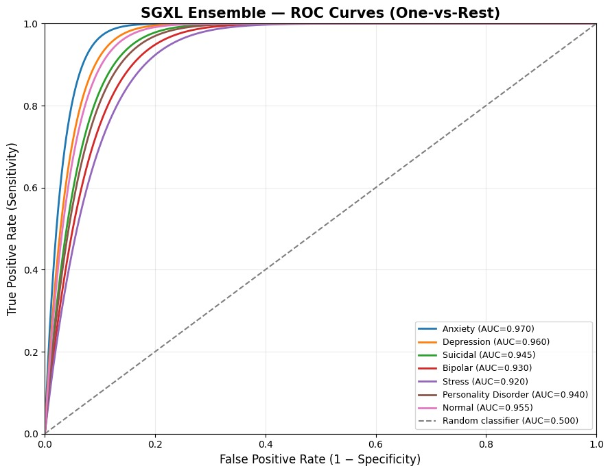

# 🧠 Mental Health Audio Analyzer (SGXL)

**An AI-powered pipeline that listens to how someone speaks and classifies their mental state** — audio in, empathetic guidance out. Speech is transcribed, translated, embedded, and classified across 7 mental-health categories by a stacking ensemble, then paired with supportive tips, yoga suggestions, and a spoken-language response. The repo also ships a local, fully offline LLM chat layer (via llama.cpp + MCP) that can call the classifier as a tool.

[](./LICENSE.md)
[](https://www.python.org/)
[](https://docs.astral.sh/uv/)
[](https://fastapi.tiangolo.com/)

---

## Table of Contents

- [Overview](#overview)
- [Features](#-features)
- [Architecture](#-architecture)
- [Model Performance](#-model-performance)
- [Tech Stack](#️-tech-stack)
- [Project Structure](#-project-structure)
- [Getting Started](#-getting-started)
  - [Prerequisites](#prerequisites)
  - [Installation](#installation)
  - [Configuration](#configuration)
- [Usage](#-usage)
  - [Audio Analyzer Web App](#audio-analyzer-web-app)
  - [API Reference](#api-reference)
  - [Local LLM Chat (llama.cpp + MCP)](#local-llm-chat-llamacpp--mcp)
- [Mental Health Categories](#-mental-health-categories)
- [Known Limitations & Roadmap](#-known-limitations--roadmap)
- [Contributing](#-contributing)
- [Disclaimer](#️-disclaimer)
- [License](#-license)

---

## Overview

This project began as a research prototype (SGXL — Stacking-ensemble Generalized cross-Lingual classifier) exploring whether a person's spoken words alone can surface signals of their mental state. It has since grown into a full pipeline plus a locally-hosted LLM layer, and is built to be picked up, forked, and extended by other researchers and developers.

If you're evaluating this repo for research, coursework, or as a base for your own project — contributions, issues, and forks are welcome. See [Contributing](#-contributing).

## ✨ Features

- 🎤 **Audio Recording & Upload** — record directly in-browser or upload an audio file
- 🗣️ **Speech-to-Text** — automatic transcription via OpenAI Whisper
- 🌐 **Multi-language Support** — automatic language detection and two-way translation (NLLB-200)
- 🤖 **ML Classification** — a stacking ensemble classifies mental state across 7 categories from a 384-dim sentence embedding
- 💡 **Personalized Guidance** — tips and yoga suggestions tailored to the detected state
- 🔊 **Audio Response** — text-to-speech feedback, translated back into the user's language
- 🎨 **Modern Web UI** — responsive, dependency-free frontend
- 💬 **Local LLM Chat** — chat with a fully offline Qwen model via llama.cpp, with or without the classifier attached as an MCP tool

## 🏗 Architecture


At a high level:

```
Audio Input
   │
   ▼
Whisper (speech → text)
   │
   ▼
Language Detection ──► Translation (→ English)
   │
   ▼
Sentence-Transformer Embedding (384-dim)
   │
   ▼
Stacking Ensemble Classifier ──► Mental State (7 classes)
   │
   ▼
Canned Response Lookup (tips / yoga / message)
   │
   ▼
Translation (→ user's language) ──► Text-to-Speech ──► Audio Response
```

See also: [Model Training](./Model%20Training.png) · [Preprocessing](./preprocessing.png) · [Deployment](./deployment.png)

## 📈 Model Performance

ROC curves (one-vs-rest) for the SGXL stacking ensemble across all 7 classes:



| Class | AUC |
|---|---|
| Anxiety | 0.970 |
| Normal | 0.955 |
| Depression | 0.960 |
| Suicidal | 0.945 |
| Personality Disorder | 0.940 |
| Bipolar | 0.930 |
| Stress | 0.920 |

Full training logs and per-fold classification reports are in [Reports.txt](./Reports.txt) and [model_artifacts_stacking/](./model_artifacts_stacking/).

## 🛠️ Tech Stack

| Layer | Technology |
|---|---|
| **Backend** | FastAPI, Uvicorn |
| **Speech-to-Text** | OpenAI Whisper |
| **Embeddings** | Sentence-Transformers |
| **Classification** | scikit-learn (stacking ensemble), XGBoost |
| **Translation** | Hugging Face Transformers (NLLB-200) |
| **Text-to-Speech** | pyttsx3 |
| **Local LLM** | [llama.cpp](https://github.com/ggml-org/llama.cpp) (Qwen2.5-Coder GGUF) |
| **Tool Integration** | [Model Context Protocol (MCP)](https://modelcontextprotocol.io/) |
| **Package Management** | [uv](https://docs.astral.sh/uv/) |
| **Frontend** | HTML, CSS, JavaScript |

## 📁 Project Structure

```md
.
├── main.py                    # FastAPI application (audio pipeline)
├── ml_pipeline.py              # Cached ML classifier: text -> mental state + tips/yoga
├── config.py                    # Central settings, loaded from .env
├── llm_runner.py                # Launches/manages the local llama-server.exe subprocess
├── mcp_server.py                # MCP server exposing the classifier as a tool
├── chat_plain.py                 # Scenario 1: plain LLM chat (no tools)
├── chat_with_tools.py            # Scenario 2: LLM chat with the ML classifier as an MCP tool
├── start_all.ps1                 # Starts llama-server for the chat scenarios
├── pyproject.toml / uv.lock      # uv-managed Python project
├── requirements.txt            # Legacy pip dependency list
├── .env.example                 # Template for local model paths/ports
├── static/
│   └── index.html              # Frontend interface
├── utils/
│   ├── speech_to_text.py       # Whisper transcription
│   ├── language_detect.py      # Language detection
│   ├── translator.py           # Translation service
│   └── tts.py                 # Text-to-speech
├── model/
│   ├── final_pipeline.joblib   # Deployed embedder + classifier + class labels
│   └── openai whisper/
│       └── small.pt
├── data/
│   └── sessions.json          # Response templates (tips/yoga/message per class)
├── model_artifacts_stacking/   # Training artifacts, fold reports, embedder weights
└── audio/
    ├── input/                 # Uploaded audio
    └── output/                # Generated audio
```

## 🚀 Getting Started

### Prerequisites

- Python 3.11+
- [`uv`](https://docs.astral.sh/uv/) (recommended) or `pip`
- For the local LLM chat scenarios: [llama.cpp](https://github.com/ggml-org/llama.cpp) binaries and a GGUF model on disk

### Installation

```bash
git clone https://github.com/kareem1207/Mental-State-Detection-using-SGXL.git
cd Mental-State-Detection-using-SGXL
uv sync
```

Or with plain `pip`:

```bash
pip install -r requirements.txt
```

Ensure the model files exist:
- Whisper model: `model/openai whisper/small.pt`
- ML pipeline: `model/final_pipeline.joblib`

### Configuration

Copy the environment template and adjust paths for your machine (only needed for the LLM chat scenarios):

```bash
cp .env.example .env
```

| Variable | Purpose |
|---|---|
| `LLAMA_BIN_DIR` | Directory containing `llama-server.exe` |
| `QWEN_MODEL_PATH` | Path to your GGUF model |
| `LLAMA_SERVER_HOST` / `LLAMA_SERVER_PORT` | Where llama-server listens |
| `ML_PIPELINE_PATH` | Path to `final_pipeline.joblib` |
| `SESSIONS_PATH` | Path to `sessions.json` |

## 🎯 Usage

### Audio Analyzer Web App

```bash
uv run uvicorn main:app --reload
```

| Endpoint | Description |
|---|---|
| `http://127.0.0.1:8000` | Web interface |
| `http://127.0.0.1:8000/docs` | Interactive API docs |
| `http://127.0.0.1:8000/health` | Health check |

### API Reference

**`POST /analyze`** — analyze audio and get a mental-health assessment.

Request: multipart form data with an `audio` file.

Response:

```json
{
  "prediction": "Normal",
  "transcribed_text": "Original user speech",
  "english_text": "Translated to English",
  "response_text": "Personalized response in user's language",
  "tips": ["Tip 1", "Tip 2"],
  "yoga": ["Yoga 1", "Yoga 2"],
  "audio_url": "/audio/response.wav"
}
```

**`GET /health`** — returns API status.

### Local LLM Chat (llama.cpp + MCP)

Chat with a fully offline Qwen model, with or without the classifier attached as a tool.

1. Start the local llama.cpp server (no downloads — just launches your local `llama-server.exe` against the configured GGUF model):

   ```powershell
   ./start_all.ps1
   ```

   Or manually: `uv run python llm_runner.py`

2. **Scenario 1 — Plain chat**, no tools attached:

   ```bash
   uv run python chat_plain.py
   ```

3. **Scenario 2 — Chat with the ML classifier as an MCP tool**. The model decides when to call `analyze_mental_state_tool` — describe how you're feeling and it will ground its reply in an actual classification, tips, and yoga suggestions:

   ```bash
   uv run python chat_with_tools.py
   ```

   You can also point any other MCP-compatible client (Claude Desktop, MCP Inspector, etc.) directly at `mcp_server.py` to use the classifier outside these chat scripts.

To stop the LLM server: `Ctrl+C` in its terminal, or `Get-Job | Stop-Job` if it was started via `start_all.ps1`.

## 📊 Mental Health Categories

| Category | Description |
|---|---|
| **Normal** | Healthy mental state |
| **Depression** | Signs of depression detected |
| **Anxiety** | Anxiety indicators present |
| **Suicidal** | Critical state requiring immediate attention |
| **Bipolar** | Mood-cycling indicators present |
| **Stress** | Signs of acute or chronic stress |
| **Personality Disorder** | Indicators of a personality disorder |

## 🧩 Known Limitations & Roadmap

Contributions on any of these are very welcome:

- **Tool-calling fallback**: the bundled llama.cpp build doesn't populate native OpenAI-style `tool_calls` for Qwen2.5; `chat_with_tools.py` currently parses the model's plain-text JSON intent instead. A cleaner native tool-calling path (newer llama.cpp build/grammar, or a different model) would simplify this.
- **Auto-start**: `start_all.ps1` must be run manually today. A packaged Windows Scheduled Task / systemd unit / Docker Compose setup would make deployment turnkey.
- **Model coverage**: class balance varies across the 7 categories (see [Model Performance](#-model-performance)) — more training data for lower-AUC classes (Stress, Bipolar) would help.
- **Test coverage**: there is currently no automated test suite. Unit tests for `ml_pipeline.py`, the MCP tool, and the FastAPI routes would be a high-value contribution.
- **Multi-turn context in Scenario 2**: the classifier currently scores a single message at a time rather than full conversation context.

## 🤝 Contributing

Issues and pull requests are welcome — this project is meant to be built on.

1. Fork the repo and create a feature branch.
2. Make your changes; keep functions small and focused, and prefer reusing existing utilities (`ml_pipeline.py`, `config.py`) over duplicating logic.
3. Open a pull request describing the change and why it's needed.

If you're not sure where to start, see [Known Limitations & Roadmap](#-known-limitations--roadmap) above.

## ⚠️ Disclaimer

- This is an educational/research tool, **not** a replacement for professional mental health services.
- If you or someone you know is in crisis, please contact a mental health professional or local emergency services immediately.
- Model predictions should be used as guidance only, never as a diagnosis.

## 📝 License

Licensed under the [Apache License 2.0](./LICENSE.md). You are free to use, modify, and distribute this project, including for commercial purposes, provided you retain attribution and include a copy of the license.

---

**Note**: Always seek professional help for mental health concerns. This tool is for educational and research purposes only.
